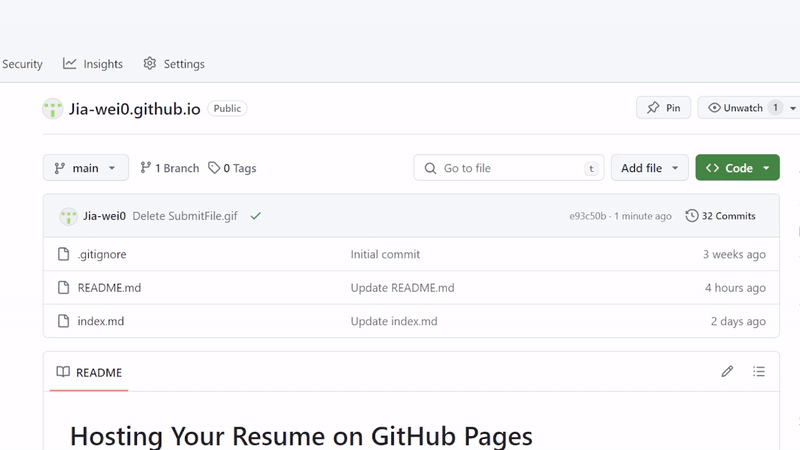
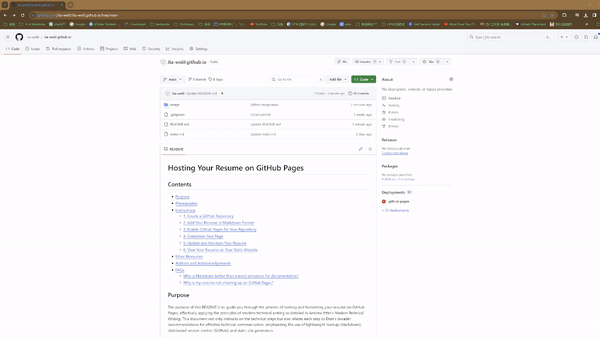

# Hosting Your Resume on GitHub Pages

## Contents

- [Purpose](#Purpose)
- [Prerequisites](#Prerequisites)
- [Instructions](#Instructions)
  - [1. Create a GitHub Repository](#1-Create-a-GitHub-Repository)
  - [2. Add Your Resume in Markdown Format](#2-Add-Your-Resume-in-Markdown-Format)
  - [3. Enable GitHub Pages for Your Repository](#3-Enable-GitHub-Pages-for-Your-Repository)
  - [4. Customize Your Page](#4-Customize-Your-Page)
  - [5. Update and Maintain Your Resume](#5-Update-and-Maintain-Your-Resume)
  - [6. View Your Resume on Your Static Website](#6-View-Your-Resume-on-Your-Static-Website)
- [More Resources](#More-Resources)
- [Authors and Acknowledgements](#Authors-and-Acknowledgements)
- [FAQs](#FAQs)
  - [Why is Markdown better than a word processor for documentation?](#Why-is-Markdown-better-than-a-word-processor-for-documentation)
  - [Why is my resume not showing up on GitHub Pages?](#Why-is-my-resume-not-showing-up-on-GitHub-Pages)

## Purpose

The purpose of this README is to guide you through the process of hosting and formatting your resume on GitHub Pages, effectively applying the principles of modern technical writing as detailed in Andrew Etter's *Modern Technical Writing*. This document not only instructs on the technical steps but also relates each step to Etter's broader recommendations for effective technical communication, emphasizing the use of lightweight markup (Markdown), distributed version control (GitHub), and static site generators.

## Prerequisites

Before you begin, ensure you have the following:

- A resume formatted in Markdown. Markdown is a simple, readable markup language designed for formatting text on the web. If you're new to Markdown, no worries—it's designed to be easy to learn. And I've prepared a [link](#More-Resources) to the *Markdown Guide* in the More Resource section.
- A GitHub account. GitHub will serve as the platform for hosting your resume via GitHub Pages.

## Instructions

### 1. Create a GitHub Repository

Utilize distributed version control systems for collaboration and versioning. Etter supports the use of distributed version control systems (DVCS) like GitHub, arguing that they are superior to centralized systems because they enhance collaboration, provide a history of changes, and allow for offline work. By creating a GitHub repository, you can leverage DVCS to manage your resume, making it easy to track revisions and collaborate with others when necessary.

Sign into your GitHub account and create a new repository named **`<yourusername>.github.io`**, replacing **`<yourusername>`** with your GitHub username. This will host your static site (your resume) on GitHub Pages.

### 2. Add Your Resume in Markdown Format

Adopt lightweight markup languages for their simplicity and versatility. Etter suggests that a lightweight markup language like Markdown is ideal for writing technical documentation. They are easy to learn, read, write, and convert to other formats such as HTML. By formatting your resume in Markdown, you're making it easy to access and maintain, in keeping with Etter's recommendation to create documents that are not only for humans to read, but also for machines to parse and process.

Create a Markdown file called **`index.md`** in your Markdown editor. After editing your resume in the file, paste the file into a repository on GitHub. Markdown facilitates formatting of the document in a readable way. Easily convert to HTML for Web presentation.    
I used a GIF image to show how to submit a file.

### 3. Enable GitHub Pages for Your Repository

Leverage static site generators to automate webpage generation from plain text content. Etter advocates the use of static site generators to publish documents. These tools, such as Jekyll (used by GitHub Pages), turn plain text into a static website. This process simplifies the publishing and updating process by automatically converting your Markdown resume to a Web-friendly format. You can see a detailed explanation of Jekyll's website in [More Resources](#More-Resources).

Navigate to your repository settings, find the GitHub Pages section, and select the main branch as the source. GitHub Pages will automatically render your Markdown file into a static website using Jekyll, a popular static site generator.

### 4. Customize Your Page

Focus on simplicity and user experience in design. Etter emphasized the importance of simplicity and usability in document design. By customizing your GitHub Pages site, you can apply this principle to make your resume not only content-rich, but also visually appealing and easy to navigate. This step enhances the user experience and makes your information accessible to a wider audience.

Customize your resume's web presentation by selecting a Jekyll theme or editing the CSS directly. This step enhances the visual appeal of your resume, though it remains optional based on personal preference.

### 5. Update and Maintain Your Resume

Keep documentation current and maintain it regularly. By updating your resume on GitHub Pages regularly, you're practicing continuous document maintenance. This approach ensures that your resume reflects your latest achievements and experience.

Whenever you need to update your resume, simply commit changes to the **`index.md`** file in your repository. GitHub Pages will automatically rebuild your site with the changes.

### 6. View Your Resume on Your Static Website

Test and review your documentation. Authors review and test their documents to ensure accuracy and validity. By viewing your resume on GitHub Pages, you're conducting a form of user testing, checking that your document is properly rendered, visually appealing, and that all information is accurate.

Once GitHub Pages is enabled and your resume is uploaded, you can view your static website by navigating to https://<yourusername>.github.io. This URL will display your Markdown-formatted resume as a web page, allowing you to review and ensure everything is correctly formatted and publicly accessible.    
I will show you how to view your resume's static website with the GIF below.

## More Resources

- **[Markdown Guide](https://www.markdownguide.org/getting-started/)**: For those new to Markdown, Markdown Guide is an excellent place to start.
- **[Modern Technical Writing](https://www.amazon.ca/Modern-Technical-Writing-Introduction-Documentation-ebook/dp/B01A2QL9SS)**: Andrew Etter's book for a deeper understanding of the principles applied here.
- **[Write the docs](https://www.writethedocs.org/)**: It is helpful for your document writing.
- **[Jekyll](https://ubc-library-rc.github.io/intro-jekyll/jekyll/)**: Learn more about the static site generator used by GitHub Pages.

## Authors and Acknowledgements

Credit to Andrew Etter for the principles outlined in *Modern Technical Writing* and to GitHub for providing the platform used in this tutorial. This README was prepared by Jiawei Fan, with thanks to all the template authors ([matiassingers](https://github.com/matiassingers/awesome-readme) and [alichtman](https://github.com/alichtman/shallow-backup)'s templates) and the group members who helped me.

## FAQs

### Why is Markdown better than a word processor for documentation?

Markdown is preferred for its simplicity, readability, and ease of conversion into HTML or other formats. It allows writers to focus on content rather than formatting and is universally compatible across different platforms and editors.

### Why is my resume not showing up on GitHub Pages?

Ensure you've named your repository `<yourusername>.github.io` and that your resume is in the `index.md` file. Also, check if GitHub Pages is enabled in your repository settings. It may take a few minutes for changes to go live, so be patient.
